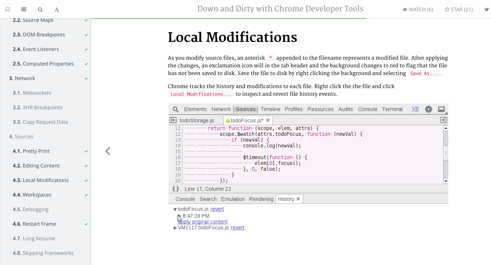

# DevTools摘要: Film strip and a new home for throttling -- 王韬懿
    
来源：[https://developers.google.com/web/updates/2015/07/23/devtools-digest-film-strip-and-a-new-home-for-throttling](https://developers.google.com/web/updates/2015/07/23/devtools-digest-film-strip-and-a-new-home-for-throttling)

时间：2015年7月23日

作者：Paul Bakaus & the DevTools team

## 关于本文

谷歌的 Chrom 浏览器一直被网友称道，而如今它又开发出了新的功能，这次 Google 带来的是 Chrom 的新的功能。您可以方便的选择下方的 toolbar 来选择新的功能 -- 捕捉页面的结构，咱们来看看这些新的特征吧。

## 文章内容

- 分类
 - [全部](https://developers.google.com/web/updates/chrome-devtools/)
 - [新闻](https://developers.google.com/web/updates/chrome-devtools/news/)
 - [建议](https://developers.google.com/web/updates/chrome-devtools/tip/)
 - [案例学习](https://developers.google.com/web/updates/chrome-devtools/case-study/)
 - [注意](https://developers.google.com/web/updates/chrome-devtools/spotlight/)
- 产品
 - [全部](https://developers.google.com/web/updates/news/)
 - [所有工具](https://developers.google.com/web/updates/tools/news/)
 - [Chrom](https://developers.google.com/web/updates/chrome/news/)
 - [Chrom工具](https://developers.google.com/web/updates/chrome-devtools/news/)

### DevTools 新闻，和它一样新鲜

在这片文章中第一条新闻是一个小的 meta - 它就是这更新！时不时的至少一个月，我会总结Chrom 开发者工具发生了什么。

当我说新鲜的时候，我的意思是：我会介绍在 [Chrome Canary](https://www.google.com/chrome/browser/canary.html) 里面的新特征，因此如果你想保持不变，那也非常酷。但是如果你很有冒险精神并且想保持在顶端，这些文章就是为你准备的。除了最新的特征和 bug 修复，你会在每一篇文章的最后找到一个我们热爱的读者的社区推动力部分。

无需更多费力，让我们来看看真实的新闻。

### 新的 DevTools

####  Film strip - 就像  Network 和 Timeline 里面的截图

就在一周之前，我们在实验之外获得了一个有重要意义的特征：一个可以捕捉 Network 和 Timeline 的页面截图能力。结构

# =============这是视频=============

在 Network 面板中，点击小小的照相机图标就可以开始捕捉结构，然后重新载入这个页面就可以开始触发这个捕捉。除了像用其他工具捕捉的屏幕，比如 [WebPageTest](http://webpagetest.org/) ,我们目前只显示真正从图像中提取出来的结构。

当双击其中的一个结构的时候会显示突起的视图（然后使用左/右箭头来定位），当结构被真正捕捉的时候鼠标经过它们会显示从面板交叉的线条，这允许你修正已经加载的部分。这样一些常见的加载问题更加简单，比如渲染块级网页字体。

# =============这是视频=============

在 Timeline 面板中，你可以通过选中在工具条中的 checkbox 来允许捕捉屏幕。和网络面板有一点不同的地方是：在这个案例中，不管有多少实际像素，我们尝试捕捉像平时我们那样进行捕捉 －  可以减少在线性刻度与其他行在 Timeline 上的截图。不用双击去预加载，视图中突起的部分在鼠标经过的时候就会出现。

这两个方面只是关于功能和 UX 很小的一部分，我们鼓励你尝试新的特征并且在[crbug.com/new](http://crbug.com/new) 提供建议或者通过 tweet [@ChromeDevTools](https://twitter.com/ChromeDevTools).

[Network throttling](https://developer.chrome.com/devtools/docs/device-mode#network-conditions), 当我们在介绍我们的 Device Mode 的时候新增了一个新特征，他在 Network 面板中有了第二个家，因此你可以在一个单独的面板中做到网络最佳化。

这个主页只是一面镜子而已：它在 Device Mode 也是可用的，因为当在你的网路响应的时候模拟坏连接也是非常重要的。

小花絮 

讨厌网络时间线上一些怪异的循环吗？我们一样。每一帧的时候我们看到的都是一些点。当你的鼠标在不断移动的时候它们看起来就好像形成了线。（https://src.chromium.org/viewvc/blink?revision=198505&view=revision）当你在不同设备之间切换的时候 Device Mode 起到保持方向的效果（https://src.chromium.org/viewvc/blink?revision=198513&view=revision）

### 社区推动力

#### Down and dirty with Chrome DevTools

[Bret Little](https://twitter.com/little_bret) 发布了这个很好的小的演练课程，这需要你有基本的 DevTools 功能，但是也提供了深入的意见或建议。当然更多有用的信息在这里，并且更多 DevTools 文档在这里。

把 DevTools 变成一个完全的开发者工具是个很好的主意，这是我们团队之前梦寐以求的，但是这也将成为一个史诗般的工程。

您是怎样想的呢？DevTools IDE 难道不是一个白日梦吗？或者你可以知道它怎么工作吗？它应该是怎样的呢？让我们和读者互动吧！

再见！

Paul Bakaus & the DevTools team